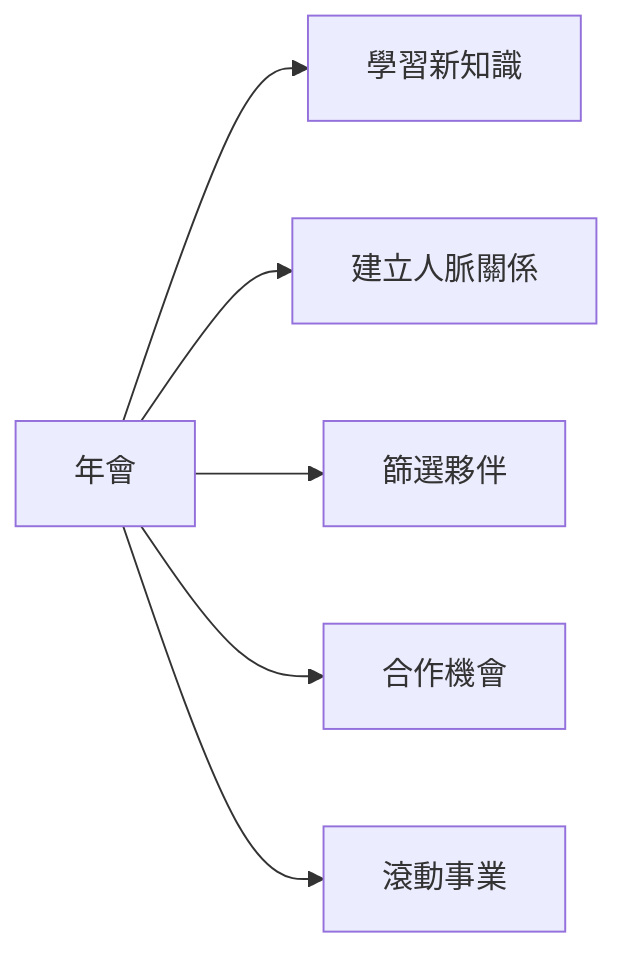

# 🎙️ 01 - 想辦法多帶一位去大會

> **檔案名稱**：01 - 想辦法多帶一位去大會.m4a
> **資料夾**：百萬小學堂
> **時長**：55:57
> **處理時間**：2026-07-13 08:34
> **Notion 頁面**：https://www.notion.so/39c23f49859081808dd9cb1f78b6ebe7

---

## 📋 重點摘要
* 這次會議的主題是「多帶一位去年會」，目的是讓大家了解年會的重要性和意義。
* 年會是一個可以讓參與者學到新知識、認識新朋友、建立人脈關係的平台。
* 年會對發展事業有重要意義，因為它可以提供一個平台讓人們相互交流、學習和成長。
* 年會可以讓參與者接觸到更多的人，增加彼此合作的機會，也可以篩選出合適的夥伴。
* 年會是一個可以讓人們滾動事業的機會，只要敢於嘗試和學習，就可以取得成功。

## 🕐 時間軸
* 00:00 - 02:00：介紹會議主題，請參與者舉手表明是否曾參加過年會。
* 02:00 - 10:00：解釋年會的重要性和意義，講述年會可以提供什麼樣的機會和經驗。
* 10:00 - 20:00：分享年會的成功故事，講述年會如何幫助人們成長和發展事業。
* 20:00 - 30:00：解釋篩選的概念和重要性，講述如何在年會上篩選出合適的夥伴。
* 30:00 - 40:00：分享年會的經驗和心得，講述年會如何幫助人們建立人脈關係和學習新知識。
* 40:00 - 55:57：總結會議的主要內容，強調年會的重要性和意義。

## 💡 行動事項 / 決策
* 參與者決定是否要參加年會，以及如何準備和充分利用年會的機會。
* 參與者需要思考如何篩選出合適的夥伴，以及如何建立人脈關係和學習新知識。

## 🏷️ 關鍵字標籤
年會、事業發展、人脈關係、學習新知識、篩選夥伴、合作機會、滾動事業。

## 📊 圖表說明
* 以下是年會的目標和內容的簡化圖表：

注意：此圖表只是簡化了年會的目標和內容，並不代表所有具體詳細的內容。

---

📝 完整逐字稿（點擊展開）

想辦法多帶一位去大會這個主題 那因為大家呢 常常常常常 都聽到很多資深的前輩 一直在提及年會這件事情 請問在線上的夥伴77位以上的參與者 有人還沒有去過年會嗎 有沒有散用一下舉手鍵讓我們認識一下你還沒去過年會的 哇有4位 5位 6位 7 7 8 8 8 9 90 9位 10位 9位 恭喜你們還沒有去過年會 恭喜恭喜恭喜 這真是你們 第一次很新奇的一個體驗對嗎 幫我關一下靜音喔 聯席主持人幫我注意一下喔 那我相信大家都 很期待喔甚至沒去過的人也不知道這是在幹什麼沒關係 我今天的目的呢就是要來讓大家知道 我不會告訴你年會裡面會講什麼因為我不會講 可是呢我會讓你知道為什麼我們需要 運用這樣子的一個會議來幫助我們發展這份事業 好所以一樣 小學堂講了四個月 四個月的 模式我們都沒有改變過不外乎就是要改變思維 改變思維之後才有辦法改變做法 喔記不記得大家有去48小時社團裡面看過成哥 聊聊天的三個故事嗎 三個故事裡面是不是也都是一直在改變的都是想法 因為想法正確我就不會貪那兩三百萬的加盟金 我願意一個一個找適合的店長 因為想法所以我的小朋友如果跟我說他不要 在這份工作他想跳脫 我會接受他跳脫因為想法 所以當工作全滿了結案子的工作全滿我不會很開心我人生就沒有風險是不是所有東西都是想法 所以一樣小學堂我們也訓練各位思維 已經四個月了如果你沒有參與齊全四個月 告訴你百萬都有重播你可以不斷的用重播重新調整一下你的思維方式 都是想法先搞 關機因 都是想法先搞定了 我們才有辦法來調整我們的實際做法好那既然今天的主題叫做多帶一位去年會 我們第一個想法先搞清楚就是那到底為什麼 我們要用年會 來衡量這一切為什麼我們要年會的人數 來衡量這一切 到底原因是什麼 我們把它搞清楚你就會知道為什麼年會這麼如此的重要年會對你我發展這個事業卻這麼的有意義 原因有四個第一個 因為一個人的力量就是很有限 我今天會在 一個人的力量跟團隊之間的力量來做一些些比喻讓你們可以更理解 第二個 大家可能沒有參加過年會可是可能已經開始有參加過我們每一個月的月課程經營課程就是我們所謂的 成功武藥學 或者是地方研討會 應該有嘛對不對 像這樣子的課程多半課程只會有幾位講師 是不是就只有一位 好所以你們能聽到的是不是就只有一位分享者他所傳達出來的思維模式 好 那年會會有幾位 大部分都超過10到20位 你可以一口氣接收到不同的講法去闡述美安這份事業 所以因為人數很多 啟動的原因機會就會變得很大 ok那第三個一旦只要能夠被啟動啟動的人數越多我們要選 篩選的機會就會越多什麼叫篩選各位 你跟我的時間是不是都一樣24小時 你是不是今天播了一個小時 你今天有聽到重點跟沒聽到重點會不會差很多 是不是差很多所以一樣意思哦 你也就只有24小時 如果你把時間花在A身上跟花在B身上會不會不一樣 如果到舉例到這邊你還聽不懂我就再舉更直白的例子來大家最喜歡聽我舉情侶了啊是不是 如果今天你交五位男朋友或你交五位女朋友請問你跟1 2 3 4 5結婚 會不會都有不一樣的結果 這就叫做篩選 看誰拿出來的專介比較大 豪宅比較大對我比較真心是不是都是篩選的原因 所以年會就有異曲同工之妙因為他可以啟動的機率比較高 那一旦啟動了我們就很能選擇要跟誰一起來合作 那我的時間花在誰身上效果就會是最好的 最後一個不用廢話了就是因為我們就是要做起來所以年會是最容易讓你可以滾動這個事業 很多成功店主最常講一句話 去年會你不一定一定會做起來可是不去年會你一定不會做起來 因為這個就是這個事業的關鍵指標 ok好我們猜看來一個一個講記不記得我們小學堂還是滾動班曾經看過這個影片右邊這個影片 一群人的力量就是很厲害嘛各位我們在做整合消費的事業 你一個人再怎麼買衛生紙到底是可以買多少衛生紙 你一個人再怎麼會用 iPhone 13你到底一個人可以擁有幾台手機 是不是任何東西自己都很有限 可是我們線上有將近90位夥伴 90位夥伴每個人都用一點點衛生紙加起來會不會很可怕 會的 一樣建立通路 最常最常如果線上你還有很新的新人你還在三個月你沒去過年會的 你一定在進來之前就想過天鵝啊 我要找多少人一起來做這個事業啊 天鵝啊 再講更直白這到底要找多少人啊 可是如果你理解 這個事業就是大家一起來整合通路電腦 到現在86位夥伴聯席組成幫我關一下別人的麥克風喔 ok 好所以我們如果是大家一起整合身邊的消費進來整合通路進來 線上所有80幾位夥伴 有原生跟我就是朋友的嗎 好像沒有耶 可是我們因為一起把消費整合進來我們透過朋友的朋友的朋友的朋友產生連結 一起進到同一個系統裡面來做同一件事情 我們大家都整合一點點互相建立的通路是不是就很大點 這單靠一個人是做不到的 所以有一句話講得很好啊一根筷子折的段 10根20根30根你怎麼折 所以如果只靠你一個人要一個一個去整合他的消費一個一個找人進來跟你一起做這個事業你要做到民國幾年 可是如果一群人的力量 就會變得很簡單 所以如果你讓你這一些朋友也都看得懂大家一起在整合身邊的朋友進來那個速度會不會快很多 這個就叫做一群人的力量我們要理解 第二個普通課程剛剛講的普通課程要讓一個人了解很有限因為只有一位講師 可是你會因為有很多位所以機率就會很高 好我不曉得大家認不認同人跟人之間就是有那種合不合得來的問題 認同嗎 念書時期就是有些老師講的我聽得懂有些老師講的我就是聽不懂 認同嗎 有沒有可能就是因為我覺得這個quick out比較合 這個人講話比較ok所以他講的東西我就更願意聽得進去一點 有嗎 有沒有爸爸媽媽跟我們講過的話很奇怪 朋友一句話明明講一模一樣朋友一個你講你就記得了老師一個你講就記得了 奇怪你爸媽的話就是耳邊風 有沒有這種常常有這種印象 這個就是很奇怪人有些時候他聽你說他就不一定聽得懂 他聽到不同人或是他覺得哇我跟這個人背景好相似喔 尤其大家最喜歡拿年紀做比較了哇我跟他年紀一樣 他比我還漂亮啊我以前都這麼覺得 今天要不要比我還漂亮啊 那這時候我就覺得嗯他講這個我也聽得懂好我也可以我做得到 所以年會他想辦法在做的就是他可以把各式各樣的人 丟進這樣的課程裡面而課程不同的講師雖然都闡述同一件事情 但只要能夠經過這個課程我啟動的人越多我們就可以一起做同一件事 一起整合消費一起建立通路一起整合消費一起建立通路在一起整合消費在一起建立通路 可是因為我要讓這一群不一樣族群的人可以一起整合消費一起建立通路 我就丟進大的課程裡面這課程裡面有各式各樣成功的人 比較年長的他就早比較年長的講師他聽了就覺得哇汪明齊60歲 哇他這樣可以保養得這麼好我要用產品我也要整合消費 哇很年輕的92 90 89年是一聽到謝正宗大三做到現在月路已經50萬 哇他我也可以做得到有些哇跟我一樣長得漂漂亮亮的看到叔叔 哇這麼美他們都是完美只要會拍照我也可以做得到 有些人是工程師他一聽到薄薇老師以前在日月光他也做得到 是不是我們丟進同一個系統裡面因為不同族群背景講話方式 照舊我們大家都覺得可行我也要一起做同一件事什麼是 一起整合消費一起建立通路一起整合消費一起建立通路 所以為什麼年會會是我們大家的武器 因為單靠你一個人你要可以跟網美說你要可以跟年輕的說 你要可以裝扮60歲你一個人裝不來呀 對吧 好 那可以啟動就可以篩選什麼叫翻牌理論一副副課牌有幾張 52張大家沒打過牌齁都在裝乖齁 沒關係我告訴你就是52張52張裡面有幾個 Ace 就那麼四個對嗎今天就算不早Ace早2 也只有4張早3也只有4張早4也只有4張 如果就是要早4張 我把他帶進最有力量的地方 我是不是就可以把時間花在這四個Ace身上 好好的跟他一起做 那什麼叫做是積極的人選 當他聽完他跟我有共同目標對我們要一起 整合消費我們要一起建立同路我們有共識我們是在創業的我們有目標我們要拿下永續收入 做事的效益會不會大大加分 好 你去想我不帶進這樣的現場讓他自己看你在家跟他說說了老半天 會有同樣的目標嗎 3分鐘就沒了 3分鐘待會大家就去睡覺了 所以 為什麼這個大這個大型的會議裡面他很容易啟動人我就很容易尋找到一起努力的那一個對象 好最後一個 講到底我們就是要做起來我們為了不就是這一張分紅制度而已嗎 我們為了不就是因為無限層次我可以累積好多好多不一樣我不認識不同族群不同性別 不同能力但是都會用衛生紙我一起累積我們一起做同樣的一件事什麼是 整合消費建立同路 我們就一直一直做這兩件事可是我們要集結大家我們才可以一起完成我們彼此的4萬7千5 可是靠你講你要講到民國幾年 今天有沒有夥伴你是被你上面的那個 資深店長提醒你說哎呀今天小學長最後一堂了今天講年會對你很有幫助你來聽聽看有沒有 有吧 那為什麼他媽叫你來一樣 他希望你透過這裡聽懂聽懂年會對你來講很重要 爸爸媽媽從小到大就教我們做人要正直 去到學校學校教我們沒有好的品性 除了社會社會也教我們要好的道德觀 其實永遠都在講同一件事情 只是每個人領悟的時間點不同每個人在什麼時機點會聽到聽進去不一樣 所以我們都看得懂這張分紅制度是我們要的 可是有些時候啊小清姐跟我說我就聽過啦 靜妮姐跟我說啊我就有聽了啊文婷跟我講哎喲啦我大概記得啦 很奇怪耶謝正宗又不是我朋友他講完我就很想做 Frank講完我就覺得我要做 劉媛涵老師講完我就覺得對這可以我回來拚了說他了 甚至有些時候是陳彥哥美文姐一句話我做了 這個就是系統很棒的地方換一個人說如果可以幫我省一點力趕快做起來有什麼不好 所以為什麼越是在這個系統深耕的資深店主 他們越喜歡運用會議 當人數到一定的狀態他們更喜歡運用會議 因為只有這樣才會省時間 只有這樣才會省力氣你看喔線上將近90位夥伴 只有我需要耗費一個小時的體力跟精神 大家只需要聚集集中想通就好了 省不省力 我幫了90幾位夥伴在省一個小時你有發現嗎 那你願不願意一起幫你自己的人生也來省下這一些時間跟金錢 好 那既然你理解到底為什麼年會對我們來講這麼這麼的重要就那四點 你把它記得接下來就是做法了 來做法是大家最困擾的 對於這一張門票大家心裡都好多好多的OS OS 這很難那天我跟一個夥伴講電話 夥伴就跟我說 我說年會剩下20幾天了我們就來想辦法多帶一個朋友跟我們去年會 他說我也很想啊 可是你知道嗎這件事很難 我說你還沒去過年會 他說對 仔細聽喔 如果線上你還沒去過年會你也覺得這件事很難的 或者是重說 你已經去過年會你還是覺得這件事很難的 我跟你說 你絕對沒有搞清楚這件事對你來講的 那個 這個工具到底有多好用你絕對沒有搞清楚 你絕對還沒有明白他對你來講是一個最好的武器 來我先說 還沒有去過的夥伴 你會覺得我很難跟人家講啊 因為我自己都不知道這裡在幹嘛了 我都不知道去我可以得到什麼了我怎麼跟人家講 那文獻上各位 你會想要對不起 你的朋友嗎 如果今天你找他賺錢 你絕對不會希望對不起他對嗎 你找他來你就是想要跟他承諾我們一起在這裡賺錢 請問你也還沒拿永續收入你到底要如何跟他講 這個事業怎麼做 方向是什麼 你搞不好連分紅制度都還背不出來 那為什麼我說這張票是一個武器 因為就是我不會說 所以我們一起去這裡看 這樣不是最簡單嗎 因為我沒辦法跟你講 可是人家成功的人都說這裡可以嘛 所以他對你最好的武器就是來來來 我們去這裡看 不行 咱們找別的機會要行咧 要是行咧 所以待會我給大家三個角度 我待會會給你三個角度 可是這三個角度的賣票 我建議各位待會你 自己速度要快一點去截圖 就把它背起來 這三個角度重點不是我文字寫了什麼 重點是你練到熟能生巧你可以 非常非常容易就講出來 那個自信 那個講話方式 所以不是看你說什麼 待會我給你的文字 是看你有沒有辦法練到變成 你怎麼說出去的 OK 所以不管怎麼樣 我們永遠是要想辦法 讓對方自己看自己感受 他可以自己看完做任何的決定 而不是你要擔保他一定會在這裡得到 永續收入會得到什麼 這不是重點 所以這對我來講是一個 再好不過的武器 我印象中我剛加盟這個事業的時候 我相信我跟很多人講過 我第一個好朋友 他當初我跟他講這個事業要邀約 然後Leader就跟我講要簡單約 要約的目的是什麼 他出來自己聽 不是他一定要在出來之前 就討論合不合作 我聽懂了 我就跟我這個朋友說 欸 我有一件事一定要讓你知道 因為我們這麼好 我最近有在 遇到一個不錯的機會 你來了解一下 我想找你 他就說好 他就說好 他就出來了 聽完之後他跟我說 欸 一心美安不錯呢 美安可以 你加油 我想說我加油 我加油是什麼意思 他走了之後 我的資深店長跟我說 一心我跟你說 欸 你想辦法帶他去這次的大會 你讓他自己聽 他看完 看他做什麼決定都好 目的是讓他自己聽 我不是要他因為去大會 一定要加盟這個事業 我說哦好 他一定要去到大會自己聽就對了 那我左三思右三想 每一個人 他會接受每一件事的方式不一樣 對嗎 仔細聽哦 我們 在追每一個男的 或是追每一個女的 請問同一招都可以打動每一個人嗎 你總要去想一下 這一個女生怎麼樣可以打動 那一個女的怎麼樣可以打動 都會不太一樣吧 對嗎 好 所以我那時候就在想 怎麼樣我這個朋友他一定會來 仔細聽我在心裡建設 我從不想很難 哦怎麼 那個怎樣不行啊 那樣講他不會不會 我會直接想怎麼樣做他會來 我永遠建立我自己的思維模式 都是肯定句 肯定的態度肯定的信心 肯定的做法 我不要給自己一堆負面的色線 好 所以我就想了 我這個朋友呢 他很吃一招 他對我呢 會很不捨讓費我的錢 因為他知道我是一個很認真的人 很努力的人 一旦我花了錢 他就一定會 盡力去嘗試看看用看看 所以我那時候就想說好 那不然這樣子 我幫他買年費票 我買票了 他總不會想要浪費我的錢 好只有我那麼多個 帶去年會的 只有這個是這樣做 就是我先漲後奏 我票直接先買了 我就跟我朋友說 欸 那個 你幾月幾號 空下來給我 然後他說要幹嘛 我說 我要帶你去美安的年會 因為一張票三四千塊 歪更累啊 你不會讓我虧啦齁 他說靠 你是不用討論的 我說 我想了想 如果這聲音真的很可以 我希望你看到他很全部的樣子 不管你做的想法什麼都好 但我希望你看到他完整的東西 我們再來討論 不然就當作去玩吧 就跟我去看看 他就說好 他就跟我去了 我印象很深刻 那一次是我第二次去年會 我第一次去年會 就多帶兩個朋友了 那兩個朋友 也都大開眼界 那我第二次去年會的時候 除了賣我這個最好的姐妹之外 我總偷偷賣了十張 魏迦蒙的門票 就是都還沒有進入這個事業 那我全部都想方設法 用他們可以接受的方法 其中有一些方法 在後面三個角度裡面 好 那我當下十個魏迦蒙 我簽了八個新店長 我簽了八個新店長 那我這個最好的朋友 我那時候越簽越有信心 簽第一個 簽第二個 很有信心 因為那時候對年會 是一個很深刻的體會 就覺得 人真的自己看過都不用 我跟他說我講 真的不需要說服別人 那時候就有一個很深刻的感受 那我當然就想說 那這樣子我朋友透動 我覺得他一定會加猛 我到最後一兩個才去找他 我就說怎麼樣 梅安大會很不錯吧 他跟我說梅安大會 就OK啊 我說什麼意思 他說我上次又跟你說 其實我覺得梅安是可行的 梅安沒有不行做 梅安真的沒有不行 那我就跟你講 你真的也好好加油 我覺得你在這裡 一定可以闖出一片天 他這樣跟我講 我現在去說說 那你這樣看完年會 總可以一起了吧 他就跟我說了第二次 一心加油 他就真的只跟我講一心加油 至今六年了 他仍然沒有合作這個事業 可是他沒合作 他現在卻是我最穩定的伍克 不管是他還是他男朋友 他媽媽還是他媽媽的男朋友 全部都是 好 我要講的是什麼 是我想辦法 讓我這個朋友自己去看 自己去感受 他可以選擇他最後不要啊 可是我要他自己看 不是聽我說 所以各位 如果你在賣門票 你會一直覺得很難很貴 是因為你想要他現階段 得到一個你心中期待的那個結果 而不是你站在 讓對方自己去了解 這個時候方法就會非常多 待會不會只有我後面 講的三個方法 你會有各式各樣的方式 來思考 如果剛剛我前面都跟各位講了 年會對你來講 是那麼的簡單又有力量 又最快可以讓一個人 跟我們一起整合消耗費 發展通路 如果是這麼容易的 你只會想要對方自己看 看完他不要篩選掉 那如果他要咧 你也不浪費時間 好所以角度一 錢 用錢的方面很容易跟一個朋友講 如果你這個朋友他很在意加盟成本 一萬五千多塊 那這個時候我會跟他講 尤其加盟計一五九七零 不如花四七九六 還比較划算 不是嗎 欸三分之一欸 對啊不行一萬五限起來 你還可以把我帶走 因為可能我走火入魔了嘛 對啊真的啊 他如果可以咧 我們就來想 怎麼樣讓這一萬五花的 最快最有價值 划算吧 你可以先看一看再考慮 那個有點像是 我們先四交往啊 我們先四交往三天 再看要不要訂中生嘛 同居再看要不要結婚嘛 是不是都是這種概念 先看嘛 男朋友不要結 那一張紙很貴 啊如果可以咧 好好的相待彼此 好好的做 這個對於很多新店長 你很想要多帶一個朋友 兩個朋友 你的兄弟姐妹 你的另一半這超級容易 真的我屢次不算 因為看完不行就算了 我我們可能 我可能哪邊卡到了 可是可以咧 我們也不要廢話再猜了 趕快做 因為時間過一天就是錢欸 過一分鐘也是錢 人家說時間就是金錢 這是第一個角度 拍完了齁 第二個角度 時間 好 時間到底要怎麼樣浪費 每個人都覺得時間很有限 每個人都有時間花在 我認為重要的事情上面 對嗎 所以一樣 我們都想要把時間花在 對我們來講很重要的事情 那美安 如果都已經跟你講 它的成功方程是三年 很認真的投入三年 一家店收入會來 請問這三年到底要怎麼花時間 想花就花不想花就不要花 今天有上小學堂上一下 明天就再看你怎麼辦 我們都知道工作是不能這樣選的 會明天 開上班的都還是要去上班欸 那如果美安這件事情 我可以只花四七九六看完 一樣先討論不行 不行 我們就去找其他更適合我們的機會 也千千萬萬不要把時間浪費 在工作四十五年 有多少人他花了人生三四十年 在一份工作上面卻發現 他的人生 既然是存不到什麼好的退休金 既然是沒有辦法讓他未來過 他想要過的生活 體力會下降 各位我都認老了 我都認了 現在都被叫疑了 搞什麼 所以時間是會過的 那可是要是可以咧 我們也不要浪費那一分一秒好不好 趕快來煮 這個時候你要跟一個人討論 就超級快了 不然各位你簽一個新店主 你現在什麼也不會講 套我剛剛一句話 你NPCP都還不會說 你要怎麼樣跟一個人開始討論 接下來要做哪些事 他不知道我有沒有那麼急迫 需要把那麼多時間花在這上面 可是明明時間一壓縮就可以 所以如果從一個他在意時間 或者是他已經工作好小些年了 其實這個東西好容易跟他說 不然工作我們再做五年再做三年 你真的可以改變嗎 沒有辦法 如果沒有辦法 這件事我們都情願日復一日了 如果每樣看一看 不行好算了再找其他 再找其他 要是可以咧 趕快把它做起來 不就解決了嗎 OK 第三個角度 人生最大的損失 就是你不知道這才可怕 問問自己三個問題 你滿意現狀嗎 請問到底去了年會你會有損失嗎 會一張年會票4796 住宿旅費3400塊 兩天的時間 好你把它算出來 美文姐當初有算出來 她算了 她還把她先生跟她小孩都帶去 還另外多買了更大間的房間 她偷偷算下 我記得她算一兩萬塊吧 她損失如果兩天一兩萬塊 可是第三個重點來了 如果去了 可以讓你之後每一個月都20萬 就因為你沒有去 請問損失多少 你算得出來嗎 我們算得不好的就要算好的 好的是你算得出來的嗎 用20萬乘以一年 再乘以你可能可以活下去的 20 30 40年 請問這個損失到底要怎麼計算 所以有些人 如果他很care 精精技巧 我們可以用損失跟他算 用現在的狀態跟他聊 這三個角度 我覺得各位 你要去把它背下來 你不一定要自自 自自一模一樣 可是你要練講到你很順這些東西 隨時跟人家聊天 我們可以聊得到 不然你真的很滿意現狀嗎 我們想一下 我們先計算 如果去得到的損失是什麼 7000 8000 我們賠得齊嗎 再賺就有了 iPhone摔壞了馬上都得 24分齊買 那為什麼這個 我們不給自己設一個 8000塊如果賠得齊 一個月多賺1000就回來 然後是去了 一兩年之後你可以月入20 兩三年之後你可以月入20 因為你沒去 你算得出來嗎 就這三個角度 頭頭就這三個角度 我覺得最大宗 當然還有更深入的一些講法 如果你常常打電話來聊 我還會再跟你聊到 更多更不一樣的一些角度跟講法 可是這些東西需要你花時間 花心思去背 所以線上93位夥伴 每一次的年會對我而言 他都是每半年 每半年 每半年的一次短暫驗收 可是這個每半年的短暫驗收 不代表這一次到了就沒了 可是我在還沒到之前 我不會放棄的 我剛剛說的那個故事 我在年會多帶了10位魏佳蒙 你們知道我是什麼時候 賣出那10張的嗎 我就在最後一個月 我基本上一天就想辦法 去見一個朋友 這條路不同就再見一個朋友 再見一個朋友 再見一個朋友 每一個只要最後跟我說 不然我先加盟 我都說我不要 你跟我去 我不要你加盟等待 我不要你浪費那個時間 我更不要你浪費那個 不曉得到底該做什麼的時候 你去完 可以趕快我們來看怎麼做 因為美安真的這個系統可以 所以這三個角度 你要背起來 我們再回到前面 為什麼要年會很涼 你一個人有限 你讓更多人看得懂 你讓年會幫你啟動人 你的時間就可以放在Ace身上 因為你一定要做起來 對嗎 這些邏輯你偷了 加上你把剛剛 我給你的這三個角度 你把它背起來 你去練 你見到人就試著去講 你有爸爸媽媽兄弟姐妹 另外一半睡在你的枕頭旁的那一個 你不要跟他吵架 你好好的跟他講 多一個人看就多一個力量 你湊滿52張 你就會翻到那四張 可是你連52張都沒有去湊湊看 你就沒那個機率你知道嗎 所以我當初在第一次加盟這個事業 Leader這樣跟我講 他說你真的不要讓你第一次年會 只有自己去 這樣真的很傻 我聽懂了 我就想辦法多帶一兩個 真的想辦法 那時候也不懂 想辦法帶一兩個 第二次真的很後悔 為什麼只帶那一兩個 冒起來 帶了30個去 每一個我都想辦法跟他談 你一定要去一次年會 去了不行去找別的機會 真的去找別的機會 可是你問你自己的人生 去一次如果可以 問你的人生拚吧 OK 好 最後的最後 我們的結果 也就是在賣年會票 多帶一個人的 想要得到的成果 我把它定為在目標 那我要跟各位說個故事 我說我今天會跟大家講 那個個人 跟團隊 到底為什麼會有所謂的 一加一會大於二的概念 各位線上夥伴 有常常聽過 一加一會大於二嗎 有嗎 有嗎 那你們可以告訴我 為什麼一加一會大於二嗎 你們可以讓我知道 為什麼一加一會大於二嗎 你們講得出什麼原因嗎 我來看看 我開了聊天室 為什麼一加一會大於二 因為互補 化學變化 團隊力量 一起的力量比一個人大 環境 因為力量 因為做同一件事情 因為一個如果都帶兩個 就編成有四個了 因為無限累積 因為可以互補 好 各位有沒有發現 因為素變會帶來相變 因為每個人做法都不一樣 你有沒有發現 大家寫下來的東西 都是抽象的比較多 都是虛擬的比較多 我們很難真正 用很實質的東西去解釋 除了剛剛蘇妹的舉例 是最實質的 因為一個多帶兩個 就變四個了 他的東西好像比較是實質 可以證明真的大於二 可是其餘的東西 有沒有大部分的人 講出來的都是虛的 一加一為什麼會大於二 因為這樣會有共識 請問共識怎麼稱 共識怎麼看得到 因為力量會很大 因為每個人都做同一件 那真的每個人都做同一件事 不然大家現在跟我做同一件事 我們在螢幕面前 來把右手舉起來 請問這樣有力量變比較大嗎 請右手放下來 好像只是比較有口令 一個口令一個動作是嗎 所以我要來跟各位 講這個故事就是 到底為什麼 一加一可以大於二 我知道我們團隊有好多人 好多人的腦袋是很需要邏輯的 所以我算給你聽 好我們把這個世界上 這個世界上生存這件事情 用最簡單的兩件事解決 一個叫吃的飽 一個叫穿的暖 吃的飽的概念就是 一天只需要補一條魚 一個人就可以吃的飽 這是遊戲規則 一天只要吃一塊布 他就可以穿的暖 這是遊戲規則 那有兩個角色 一個角色叫張先生 一個角色叫蘇小姐 來 張先生呢 他一整天要吃的飽又穿的暖 他必須要花四個小時補一條魚 三個小時吃一塊布 也就是他一天要花七個小時 他就可以吃的飽又穿的暖 OK嗎 好 那蘇小姐呢 她真的是一個比較厲害的人 能力比較好的一個女孩 她每天在吃的飽穿的暖 只需要花一個小時加上兩個小時 所以她一天只需要花三個小時 她就可以吃的飽又穿的暖 到目前為止 你有沒有發現蘇小姐 如果以業務型形態社會 以一般我們的職場 她就是一個人生勝利組 她就像是個主管 她就像是給我們身邊 那個比較厲害的同事 比較受人家愛戴 因為她的能力、效率各方面 都比張先生好 如果你還把美安當業務型態 你就會覺得我 一心我就是蘇小姐這個角色 是嗎 那我們怎麼樣來證明 如果個別 那是蘇小姐很厲害 那總體呢 如果把張先生跟蘇小姐 變成 你幫我把聲音關掉 如何把張先生跟蘇小姐 變成一個團隊 那會發生什麼事 如果變成一個團隊 並且我們來節長補短 每個人都有每個人的長處 對嗎 你相信我每個人 一定有每個人自己的優缺點 沒有錯 張先生蘇小姐 張先生他不管在吃的飽穿的 都輸給蘇小姐一點 可是他還是會做 比起來 他支部的能力 還是比捕魚的能力好一點 對不對 好 於是呢 我就取了張先生的 支部能力跟蘇小姐的捕魚能力 蘇小姐每天補兩條魚 張先生每天支兩塊布 互相交換 他們是不是一樣 可以符合吃的飽穿的暖 但是 他們卻可以每個人都爭取 回來多一個小時 你有發現價值差別了嗎 沒有錯 張先生他看起來 真的不是很厲害的人 可是他還是都會做 我的重點叫做 他還是都會做 蘇小姐他是很厲害的人 但他還是也有一點點弱點的地方 如果可以幫蘇小姐 這樣的人再多省一個小時 那也很棒啊 這個就叫做團隊 我為什麼要跟大家講團隊 我這幾天跟很多夥伴在討論 在聊天 在討論一些執行業務的事情 我發現 夥伴很容易 拿別人來涉嫌自己 拿別人來衡量比較自己 就覺得哎呀 我就沒有一心會講嘛 我那個ABC就沒誰多嘛 我的組織就沒誰大嘛 這些很重要嗎 我們彼此都有彼此很厲害的能力 一定都有一樣 贏過旁邊那一個人 一定都有 你現在視訊中裡面 你絕對有一個能力 是比你旁邊那一個人好一點 就一個就好了 我們只要彼此都有 那一個比較好的能力 我們就彼此互相cover了 不是嗎 可是前提是 你至少要會補餘 也要會支補 你不能當總員啊 對吧 你不能當總員啊 你還是至少要會 為什麼我要跟大家講 一家一大於二 你去想哦 如果我們視訊上這94位夥伴 你們今天都聽懂我講的東西 我們不要多 我們每一個人多帶一個人 進入年會 你覺得 對於你多帶進來的那一位朋友 影響的力量會不會變得更大更大 更大更大 會嗎 會吧 你多帶進來那一個 他瞬間多看到兩百個人 感覺怎麼樣 所以至少我要會這項能力 對嗎 我多帶一個 他就有可能 因為誰帶來的那一個 互相產生 化學作用 化學變化 是否 這個就是團隊 團隊之所以為團隊 就是要大家一起 所以為什麼今天叫做想辦法多帶一個人 為了你自己 也為了我們大家一起要賺到錢 真的每個人出一點點力量 這個力量絕對很大 所以關於 我們多帶一個朋友 到建立一個團隊 我們來看 這一部影片 我好像沒有共享聲音 等我一下 我們來看這一部影片 去真正的去理解 到底為什麼我們要強壯 跟著我們的朋友 跟著我們的parner 甚至跟著我們到這個現場的新朋友 他就會跟著我們一起 整合消費 發展通路的那一個精英份子 OK 好 我們一起看 我們聽 我想請現場的男生去設想 或者是回憶一個場景 你的女朋友擺著臉站在一邊 突然就很委屈地哭出來了 因為他什麼他都不開口的 寶寶心裡苦 但是寶寶不說 這個時候你心裡很慌張 你想不對呀 怎麼回事呢 上個月看中的包我買了呀 昨天的朋友圈我點贊了的呀 前天前女友發過來短信 我刪掉了的呀 這個時候 他大小姐終於開口了 他說 我也不知道為什麼 就是沒有安全感了 這個時候你的內心是崩潰的 因為這是他第一百零一次 跟你提出安全感的概念 鼓掌的那個哥們 可能你女朋友跟你提了兩百次 這個時候男生會很沉默對吧 然後你妹子看你不理 他就很慌啊 他就跑到知乎這樣的地方去提問 他發了個帖子叫 跟男朋友說沒有安全感 男朋友不理我了 姐妹們我該怎麼辦 在線等挺急的 這種貼字底下 給家一般評論也不會太多的哈 但是通常會有一個 保驚沧桑的老司機 說一句廢話 這個廢話被你的妹子譽為真理 老司機就說 妹子 安全感不是男朋友給的 安全感是我們自己給自己的 這個老司機說的其實沒有錯 生活中的安全感 是我們自己給自己的 好好工作 會有物質上的安全感 好好學習 才能有期末考試的安全感 不做死你就不會死 那是愛情的安全感 安全感的本質 是我們用自己的努力 和生活進行了一場等價交換 但是今天我想說的 是一份不基於任何條件 不需要努力 我們往往身在福中 而不知福的安全感 今年春天的時候 我們學院組織同學 去各個國家實地調研 我選擇了去 位於中東地區的以色列 這個國家多災多難 但卻是國際強國 所以我對它充滿了興趣 有兩個細節 奠定了我對於這個國家的看法 第一個細節發生在機場 當時我去拖雲行李 大家都知道你拖雲行李一般 就是五分鐘到十分鐘的時間 不會有人問你太多問題 對不對 但是那一天 以色列的安檢人員 對我進行了長達 半個小時的盤問 你教什麼 信什麼 從哪裡來到哪裡去 念過什麼學校 做過什麼工作 去過哪些國家 有過什麼夢想 寫過什麼論文 愛過誰 全部都要問 我覺得很被冒煩 因為我是一個普通的遊客 你為什麼要把我當成恐怖分子 這個時候我身邊的 以色列同學跟我解釋 他說 這其實是我們以色列 長空多年的常態 自從1948年建國以來 我們一直受到 國際上各種恐怖勢力的襲擊 阿拉伯世界至今 沒有承認我們的國家地位 所以我們只能用這種最保險 但是最笨的方法去排查危險 國家太小 襲擊太多 我們輸不起 第二個細節發生在機艙裡 當飛機下降在 特拉維夫這座城市的時候 機艙裡響起了一陣掌聲 我很納悶 因為整趟行程是非常的安全的 沒有任何氣流顛簸 換言之 它是一次常歸到 不能再常歸的安全著陸 在這種情況下 鼓掌有意義嗎 我的以色列同學又跟我解釋 他說 每一趟航班 無論是國際航班 國內航班 只要安全著陸 我們就一定會鼓掌 因為我們對於安全 有一種執念 二戰時期 納粹對猶太人展開種族屠殺 我們的父輩不是在逃難 就是在逃難的途中遇難 從那個時候起 我們成為了一個 沒有安全感的民族 所以我們今天所做的一切 就是重建安全感 他的話讓我意識到 不安全感 對於一個國家 和他的國民而言 是一種怎樣的體驗 不安全感其實不影響 你綜合國力的提升 因為不安全感 催人奮進 所以今天的以色列 在國防 軍事 科技 農業 商業 金融你能想到的任何領域 都是世界強國 但是這樣一種不安全感 一旦滲透進每一個國民 他自己的生活中 一旦蔓延進每一個國民 他自己的心裡 會讓人失去一份 心安理德 這份心安理德意味著 你不需要向外界去解釋 你國家存在的正當性 你不需要時刻去地方 國土安全 你更不需要 因為擔心國破家亡 而流落他鄉 這份安全感 是一個國家給國民 最根本的安全感 生活中的安全感 就像我們開頭所說 它很多時候是一種等價交換 但是國家層面的安全感 是拋開個人因素不談 只因享有國民身份 就可以免受漂泊 免於恐懼 在美國的時候 我的班上有一個 來自敘利亞的同學 當他折制我畢業之後 就要回到中國的時候 他跟我說 他說 我很羨慕你 我的國家常年在內戰 雖然在今天 我們兩個都是在美國的留學生 但是我們各自都還有一個身份 我的身份 叫敘利亞難民 而你的身份 叫中國國民 難民 與國民的最大差別 在於你是否擁有 自由選擇的權利 你是否一定要 將自己的命運 寄託在一個別的國家 寄託在一紙 非常冰冷的移民法案 還是說 你可以輕飄飄地講 世界那麼大 我想去看看 可是家裡這麼好 我隨時可以回得來 安全感 所帶來的自由選擇的權利 是一個國家 賦予年輕人 最好的禮物 因為這意味著 你不必一定要 在別人的國土上 成為一個 非常優秀的個體 才可以被尊重 你就踏踏實實地 做一個 哪怕普普通通的中國人 也會被善待 因為你的背後 是一個穩定的國家 而世界對你的國家 充滿敬畏 在美國讀書的時候 我經常在課堂上 被我們老師安排 去向大家 解釋這個 中國的十三五規劃 一路 解釋我們剛剛出台的 二胎政策 又或者是南海衝突 其實我的語言 是有很多瑕疵的 我的觀點 可能也很平凡 但是這樣的 我能在課堂上 永遠有一絲話語權 那是因為 他們覺得 中國很重要 所以 中國學生的話 一定要聽 一百多年前 梁啟超先生曾經說 今日之責任 不在他人 而全在我少年 強則中國強 一百年後的今天 其實道理反過來 是一樣的 中國強則少年強 中國強則中國少年強 因為強大的國家 會賦予一個少年 強大的安全感 基於安全感 它可以自由的選擇 它想生活的地點 職業狀態 乃至是心情 它是清裝上證 去看這個世界 又理直氣壯的 回到自己的家園 有一句話 是這樣講的 他說 你活得很舒服 那是因為有很多人 在默默地為你付出 如果你覺得很安全 那是有很多人 在為你承擔風險 他們是邊疆官兵 維和部隊 外交官 公共服務的各行客 也為了你 和我更強的安全感 在不懈努力 但即便是不懈努力 如他們我們的國家 還是有很多 不完美的地方 我們也有 自己的不安全感 所以在這個意義上 今日中國固然強 但是今日之中國少年 唯有更強 因為只有這樣 我們才能夠驕傲的回應 一百多年前 梁啟浩先生的期盼 告訴他說 少年強則國強 中國強 和中國少年更強 中國強 就是因為 少年強 為什麼要給各位看 這個影片 我想讓大家知道 沒有錯 這次很特殊 我們竟然會在一個 玻璃南港展覽館的地方 做年會 也因為這一次 全球的這個疫情 真的造成 造成 好多好多事情 都在改變 都在變化 我不曉得 線上的夥伴 你我的心裡 有沒有 都有一些化學變化 有嗎 多多少少我相信 我們都產生了 化學變化 可是這必須要靠 我們大家一起團結 團結什麼 我們希望這個團隊強 原因是因為 我們帶進來的夥伴 他能夠更感覺到 他所期待 他未來的希望 是可行的 是有辦法的 我希望這團隊強 必須讓我們大家一起強 對嗎 所以在建立這個 強大的安全感 其實大家 所一起步出的那件事 不用很多 因為環境在改變 我們的心沒有變 我們都期待 我們期待3年後 我們的生活 過得跟別人不一樣 所以 我們要一起 付出我們的那一點點 讓我們大家變強 記得剛剛講的嗎 只要我們團結起來 每個人做一點點 我們彼此 就可以互相cover 就可以讓IDM 變得很強 94個夥伴 各帶一個 目標只需要加1 不用加3 不用加5 不用喊很恐怖的口號 我就去想 我怎麼把我姊姊帶去 我怎麼把我 那一個最好的朋友帶去 我多帶一個 整體的環境 就會變得很強 你帶他去 他就會擁有希望 他有希望 我們要一起 讓這些人 跟我們做同一件事情 他賺錢 你賺錢 這不才是 我們加盟 這個事業的目標嗎 OK 所以 我們今天結束後的目標 就是每個人想辦法多1

