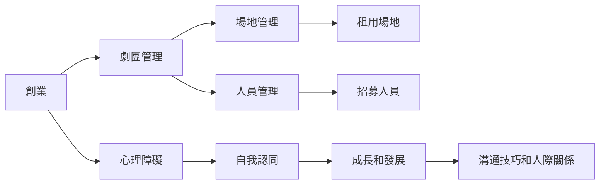

# 🎙️ 剛想做的夥伴沒有打好配合先鼓勵做好的地方再調整其他地方、加盟時間不能代表他什麼都懂

> **檔案名稱**：剛想做的夥伴沒有打好配合先鼓勵做好的地方再調整其他地方、加盟時間不能代表他什麼都懂.m4a
> **資料夾**：案例復盤
> **時長**：25:24
> **處理時間**：2026-07-21 02:34
> **Notion 頁面**：https://www.notion.so/3a423f49859081ec99a2e98ac661cb4b

---

## 📋 重點摘要
* 對於一位年輕朋友的生意經營進行探討，包含其對白天上班和晚上經營劇團的平衡。
* 該朋友面臨的困難包括劇團成員的工作平衡、場地和人員的管理難題。
* 對話中提及了創業中的挑戰和創業者的心理狀態，包括自我認同和對事業的熱情。
* 討論了如何幫助創業者克服心理障礙和疑慮，同時也涉及了對於創業者身份認同的思考。
* 提到了一個人的成長和發展需要適當的引導和支持，尤其是在創業的過程中。
* 對於創業的困難和挑戰，需要更多的實踐和經驗來克服。
* 討論了創業過程中遇到的各種問題和挑戰，包括人際關係和溝通技巧。

## 🕐 時間軸
* 0:00 - 5:00：介紹朋友的背景和對白天上班和晚上經營劇團的平衡進行探討。
* 5:00 - 10:00：深入探討朋友面臨的困難，包括劇團成員的工作平衡、場地和人員的管理難題。
* 10:00 - 15:00：討論如何幫助創業者克服心理障礙和疑慮，同時也涉及了對於創業者身份認同的思考。
* 15:00 - 20:00：提到了一個人的成長和發展需要適當的引導和支持，尤其是在創業的過程中。
* 20:00 - 25:00：對於創業的困難和挑戰，需要更多的實踐和經驗來克服。

## 💡 行動事項 / 決策
* 幫助朋友克服心理障礙和疑慮，鼓勵其繼續在創業的道路上前進。
* 提供適當的引導和支持，以幫助朋友發展和成長。
* 幫助朋友解決劇團管理中的問題，例如場地和人員的管理。

## 🏷️ 關鍵字標籤
創業、劇團、工作平衡、場地管理、人員管理、心理障礙、自我認同、成長、發展、溝通技巧、人際關係。

## 📊 圖表說明
若需使用 Mermaid 語法畫出相關圖表，則可能包含以下內容：

---

📝 完整逐字稿（點擊展開）

下北那個朋友大概24歲然後一年多前聽過生意 對白天在爸爸的 公事上班當行政然後晚上他有自己的 組一個劇團 對 然後昨天去的時候他是有跟我說他這個朋友有一點害羞 可是手都會很好聊 然後昨天是因為是剛好是世界真奶日他就也幫我買了一杯真奶 他昨天什麼日世界真奶日世界真奶日對他也是跟我說是世界真奶日你不喝一下嗎我說哦好吧就喝一下 然後就是就是身邊幫我買了一杯 然後他進來的時候我就講說為什麼我不喝冰的 有精痛的問題然後講完之後 這個女生就說其實他有復刻的問題然後現在在用中藥做調理 對然後來就開始做保養 然後其實我自己覺得我昨天那一場很 我自己覺得我很怪 有點太想要 聊危機感 幫我自己搞得很奇怪然後我就會就問他說 哎那你 我就我想了解一下那個劇團的運作是怎麼樣所以就問他 他說現在劇團的成員呢大概都是 就像他一樣有自己的證實然後其他時間 就是需要表演一個劇的時候再把他們摳來 那我就問他說那 這是我說這是你很喜歡的事情嗎他說對 他說但是 很多時候遷不到位 他說當演員之外他還有去做當別人音控 音控有時候一整天這樣找出晚規可能超過12個小時也才拿兩千五而已 他就其他其實覺得做起來很辛苦可是這又是他 很喜歡做的事情 所以他白天的工作就完全不能放掉不然沒辦法支撐他的 他的夢想 然後我就問他說那 如果你 這個錢不是問題你會想要把你的劇團做到什麼程度 他說他想要成他想要去立案 就是可以有一個地址然後可以 就是人家找得到他們然後他說但是困難就是必須要有一個地址他必須要有一個場地 然後再就是人員 要有名冊 他說目前這兩塊是非常非常困難的 然後在中間我就開始教我的兩分鐘廣告 然後他也會很認真聽 然後講完之後他也沒有什麼反應 然後我就Q了小北我說小北那你呢 我說你 你做這個生意是為了讓你 就是你在上阿卡貝拉能夠更 做自己想要的事情嗎 他會我說 不是欸 對 超雷 而且前面在用 洗臉鏡的時候 那個女生廁所放洗臉鏡小北就問他說 廁所洗臉鏡是你的嗎 因為他們是兩個女生住在一戶裡面他說對啊是我的 他說哇你好棒哦我到現在還用毛巾 我整個 對傻眼然後他一副 我做錯什麼事嗎就一副天真無限的樣子 我覺得他有一點太過於不穩重 就是會 應該是還是怎麼樣 應該比較不穩重 那個問題應該比較像是 他還沒有真正把自己放進創業這件事情 有他看起來有在想改變 可是那個想改變跟真正知道自己已經在創業 沒有那個創業的樣子 嗯 好 問題應該怎麼樣 好 沒有創業的樣子好 對前面就就一開始就雷到這個我說天啊說什麼 然後到兩分鐘廣告說我這樣問他 他說不是欸 我我我忘記他講什麼缺乏就跟我想要聽的不一樣 然後講完之後 其實我只想要讓他可以多講一點自己就他沒想要開始講我 他說我我認識丸琳的時候我覺得他 是零售大師欸什麼什麼的 都想說天啊 然後他朋友就是一臉呆呆的 這個就很這個就很吃他因為他現在代表 這個可以看出他兩件事 兩件事一就是 他開始投入了 哦 對這件事蠻蠻棒 那第二件事就說他投入之後他也開始願意表達而不是 關他的事 嗯那只是說在表達的這個過程裡面就是 他不知道什麼 該怎麼說會更好 所以代表這個是 訓練我們訓練他訓練不足 嗯 就像夥伴要上場要上舞臺 我們太過 怎麼講 覺得他會準備好了 嗯 應該這樣說 對 對 就是沒有幫他真的吧 就有些人他準備開始要執行我們有沒有幫他開始穿裝備 嗯 這個就很吃 因為這有些時候是吃A如果不幫B穿裝備就代表你 平常反應夠好 嗯 那第二件事情就是你事後的調整 可以讓他舒服 接受 對 對我覺得這也蠻重要的 嗯 對不然就會很容易是 他的感受沒有那麼好 嗯 因為就很像我現在願意做的結果又被修正 嗯 對這件事 就是也蠻重要的 對我昨天為什麼去看海就是我覺得我自己都覺得有點悶 嗯 悶的臉什麼悶的法帶他無法把他交好 對就是我覺得我這場沒有辦法讓他往前 嗯 然後我就我也在我就是自己在思考說 好像這一場的前置作業沒有準備的像第一場那麼充足 沒有幫他想這麼多可能會發生的問題 對 對 嗯 好像有一部分在於 我覺得我對可能對這個行業 沒有那麼熟悉 對好像抓不到那個 雖然已經有黃柏惟那個第一個例子就是走這種藝術相關的人 然後我也看我也看看gbd會不會找了一些資料 但就還是 太少接觸這樣的的族群 然後我自己又太過想要怎樣 就是可能想要再幫他看能不能重新邀約之類的 就覺得自己很怪 我所以我覺得我覺得因為你聚焦太多次 哦 沒有疫情放而定位 就有點像我說如果今天我知道小貝 他已經開始進入一個有意願的 嗯我今天如果讓他整體是順暢我先不窮 一定要復原到什麼關係為什麼從不重新邀約 嗯我只要可以讓他 在這件事情上是 越來越有收穫有成長 讓他做事是做得好的 我覺得這件事就會把他打打架 嗯對 對所以我前置定位可能就會跟他說 我覺得最近你的狀態很好放 是現在可能是在於你會不曉得 可以跟朋友講些什麼或怎麼說話 那像幾天我待會要跟你點出來的東西 都不是你做不好 是我覺得我們可以換位思考 像你自己要我們要約別人做保養 那所以我們也是知道 就像你會鼓勵他幫他用洗臉機 就是你這樣洗臉機對皮膚比較好嗎 嗯那你還在用毛巾這件事情 我覺得也不是不對 是你鼓勵他卻自己 待會要幫他做保養 我們要用洗臉機把他洗臉 但我們自己卻沒有這個習慣 那就像我開了咖啡廳 然後我跟對方說哇棒 你每天都會來我店裡喝咖啡 可是我自己拿著行巴克的咖啡 嗯 這樣是不是怪怪 所以我覺得你 鼓勵別人這件事明明就超棒啊 那你做你後面多講的這句話 會不會讓自己 有點陷入一個困境 別人可能會對我們講出來的話 有點覺得尷尬 這什麼意思嗯嗯嗯嗯 對 就我覺得我會讓他開始懂的思考 然後讓他知道尷尬的時候 不用急著不話 我就是他最好的 嗯就是搭檔啊嗯 對的所以有些時候 呃他真的不知道要接手用緊張 我就我也知道他現在很想要 盡力一起把事做好 就這樣就很棒 嗯 我覺得我會 肯定他現在想要表現的願意表現 我覺得這件事沒有錯 現在問題不是對跟錯問題 是他腦袋沒有東西 嗯 所以他才會不知道該說什麼 然後包含其實他想把我們 跟對方拉緊這樣也沒有錯 嗯 對 就說很棒 覺得你有想讓我跟你的朋友更接近 哎 可是如果可以的話 因為對方也沒聽過 我們講零售大師會不會嚇到的 嗯 因為這時候平時應該是 在每樣大家會理解 可是在外面人家會去哼 零售手 嗯 哇我覺得外靈就是一個大姐姐 他就覺得哇哦為什麼 他身上有好多東西 都可以教會我哎 嗯嗯 嗯 對 就是我應該教他 怎麼從旁人視角看生意 跟他自己看生意這是不一樣的 帶他回頭去 因為他畢竟家盟 跟他肯定快忘了 一般人剛開始在看美愛的感覺 嗯 不是不好也不是要自殺他害怕 而是他應該要去換回思考 他可能沒有想到 嗯 這件事情 嗯 懂 好 因為像後來他講你說 大師之後一朋友他的朋友就是 一點問候 然後我就我就趕快接說 我在這個生意上認識很多朋友 我說其實我平常接觸的朋友 可能就是醫療業的 我是工程師 我說很少有像你們這樣子 走藝術方面 而且這麼有熱誠的朋友 嗯可是 叫你也很跳痛啊 嗯 他他講零售大師他朋友認住 我可能要先解釋他在講什麼 哦 對我可能要跟他講沒有啦 其實小貝是在說 我們一起進的這個網路聲音 他可能覺得我在 某一塊做的蠻好的 但其實也不是什麼大師啦 我也都是從這個聲音 因為有很多人叫 這樣講真的叫我扛業績 康 因為我是做燕光的嗎 你叫我扛業績這件事 我就覺得蠻痛苦的 所以我才做不了什麼大師 這邊的大師講出去會笑死 嗯 對啊嗯 懂 對啊我就說我們就進這網路聲音 你有沒有聽過說生意客人就 差不多十來個嗎 哈哈哈哈 我客人裡面還有一些是我媽媽 我阿姨我誰我弟弟 我弟弟姐哈哈這樣叫大師 超好笑的 然後我他對 如果他對這件事瞬間比較軟化 他就說哦是哦 說對啊這也是我選擇這個產業 我覺得至少像我這麼一般的人 只是個燕光師 我覺得我可以做得到 我就覺得蠻棒 像我現在做保養這件事 也是在培養我的第二專長 因為我選擇本科系 也是因為這個聲音學的 然後後來就很多朋友給我做 然後也作者作者蠻有心得 因為看到大家因為 呃夫夫子可以改善 又用平體版的一些產品 我覺得蠻好的 所以做這聲音蠻有成就感 可以幫到一些人 他就會知道一些事就是哦 你並沒有做很多客人 就被稱大師 哦你在這裡學了一些事情 可以幫到別人 嗯 對吧 這應該是轉彎的地方 哇哦 天啊好 我就覺得 同一個這就是我說的 除非你不 我們沒有幫B穿裝 因為有些時候 我覺得有些A是 他他想幫B穿 但他也不曉得會遇到什麼狀況 當天會遇到什麼狀況 那這個倒也沒關係 所以其實臨場反應 就是一個很重要的過程 所以像 你這種東西的副盤就很有這樣子 嗯因為這種 這種副盤比起太雜碎的其他東西 有些像我說有些過太久就算了 嗯因為其實可能也沒那麼細節了 嗯 可是像這個你看這就很很即時 因為如果你又再一陣子 又做到小北的保養 你馬上就會找到這個 敏感度 嗯因為就哦對不對 我下次要做他最好的 轉彎他就訓練你回 回化的那個敏銳度 嗯 真的 好 然後到後來因為就覺得 好像也 嗯就是我覺得每一個都沒有銜接好 他朋友可能也覺得我們很認真好 但是沒有那一種被帶入的感覺 就更可樂的感覺了 然後最後有接待他產品但是他 我覺得可能也有淺的考慮 輸他就沒有任何的表示這樣子 對接待他的時候 然後 後來我就 問他 因為我就整個過程當中都很 沒有想像中的那種順利 那我可以很自然的他說 哎為什麼你聽得到說沒家母 一直一直到要離開那房間的時候我才 就開口問了他 然後他就說嗯 他覺得這很像愛多美 因為他家人就之前有愛多美的東西 然後老師就會了解愛多美他覺得哪裡像 他覺得製度像 哦製度像哦 但是說但是說但是他說 但美安比較不一樣的是他有 就是我沒有很多的廠商 嗯那他覺得製度像 所以他是不喜歡這樣的製度的理由是什麼 就後續沒聊到 因為後來就他們趕著要去坐車 哦對然後就很衝衝的下去 然後 我覺得那時候也沒有問 沒有問清楚小北說他是可以留下來的嗎 沒有他們兩個要一起坐火車回屏洞 對 所以我就覺得 嗯我自己覺得因為沒有讓他往前 所以後續他也沒有在很積極的想要討論 我就我今天問他說哎你今天有上班嗎 他說他跟家人出去玩 所以還沒有機會跟他 就是副盤道 那我自己覺得好像我也不知道要怎麼 要怎麼跟他調整 或是我自己該調整哪裡對 沒有那現在聊完就比較有方向 嗯 好 我可以讓先鼓勵他認同他 就是他有在改變啊 因為我其實他有在改變的吧 有其實就是他有改變 對只是說那個改變還不是成績 上很大的什麼調整嗎 嗯他可以肯定他還是要比修正他多 所以我覺得你比較像是要跟他 站在同一陣線去副盤這個過程 那過程就有點像 哎你覺得如果從來不用 這個地方這樣講會不會更好啊 這樣的感覺 那他只要有意識到哎對也會更好 其實就加分啦嗯 對啊 對嗯好 那明明跟他聯絡一下 嗯好的 然後剛剛雅清姐那一場 嗯 因為他姐真的完全沒有照 照這個流程做過 嗯然後他一開始 啊我今天我沒有先通電話 他有把這個人 他一開始就文字上打得很尖端 那後來他又自己打電話來 我就趁中午趕快跟他聊一下 這個人的情況 然後就跟我說他有什麼產品 嗯但我覺得也沒有 我覺得我剛自己想說有一個地方沒講清楚 他說他有 ndi 潤膚霜 但他最後帶了他自己喜歡的 像素誰聽說 啊 所以他是用他的爽度 喜歡的程度做這些事情 對是嗎 對對對 他其他的產品就我我帶 幾乎都是我帶的什麼 c 跟 b 他都沒有 嗯嗯嗯對 然後在電話中有去 長在化妝棉的時候 我說一姐你有化妝棉嗎 他說有啊就普生那邊 普生就是買了然後沒用 嗯我說你那個是很薄的那一種嗎 他說沒有有一點厚度 我說那要不要我帶我的 我說薄的話就是 比較輕頭然後也不用浪費這麼多的 化妝水 他就跟我說 不會我都用這麼多啊 嗯嗯 然後我就跟他講說 哎我們是可以用這麼多沒錯 但是我們的夥伴可能沒有辦法 嗯嗯嗯對 然後他聽完就說哦好 對我說那我也帶了 嗯不過我覺得我反而在這一件事情 嗯嗯嗯我就不會修正他哦 因為他的例子比較不一樣 是因為那是他的族群 對你說你其實你說對了 你你的言語中完全對 就是我們的夥伴不行 所以你這句話也表明了 其實他是可以的 嗯你你聽得懂嗎 他的能力可以不是不是 不是不是對他的能力 他的族群他的經濟他願意他可以 你說這句話完全正確 但你自己沒有進入這句話 嗯 再一次哦 你跟他說這句話是對的就是 我們可以我們的夥伴不行啊 對我們的夥伴可能做不到啊 嗯所以是夥伴做不到 但他可以不是雅清做 對啊才可以啊 他又還沒有走進複製階段 嗯幹嘛強求他現在做複製 哦 懂意思嗎懂意思懂意思 雅清姐的狀態現在需要的是 累積他的信心嗯 對吧他應該先創造成就感 產生信心 越來越覺得自己做得到 嗯你去重視他 未來有沒有人可行 嗯如果你說太大的東西 要做修正比方 你說像素水凝霜這個確實有點 嗯比較好笑一點嗯 對就是啊蠻over的 對會做出來效果很好 對他如果效果確實沒有我們用 的雙類好的話 那好像要做一點點調整 可是如果以 以化妝棉他覺得他要就是 想給朋友用很多 嗯他可以 他如果效果也還比較好 那我反而會讓他做嗯 只要他未來開始在協助 他的夥伴的時候 我就會去提醒他 因為我對他這件事有印象 我就會提醒他說哎姐你要記得哦 我們的夥伴可能沒辦法 或是我陪他做他的夥伴的時候 嗯雅清姐很大方但夥伴有反應 嗯讓夥伴反應出來也沒關係啊 這時候雅清姐自動會修正 嗯然後我反而可以跟他夥伴說 哎你看可是姐就是很大方 所以他就是有做生意的態度啊 哦 對吧嗯 對啊啊但是我就跟夥伴說沒關係 那我們用什麼的做平體做替換 其實也是可以的啊嗯 對啊哇有一件事情有這樣的 兩面對對對就是那是一種 你你要顧及雅清這個位置 在顧及未來他的發展 可是有些說我們對雅清這個 雅清只是一個代名詞啊 就類似我們對雅清這個人 的彈性度不夠很嚴苛 嗯那那個嚴苛會把一個人搞死 哦就怎麼這樣也做不好 那樣也不對 可是重點我現在就沒組織嘛嗯 對不讓一個人追隨不起來 了解你也可以觀察有些時候 我在對這樣子的人 對有些地方我會讓一點點 有些地方嗯 可是有些地方我確實還是有一些些堅持 可是他是可以被調整有彈性的嗯 對對對 好像是就我很內心 因為覺得嗯他經營的比較久 或是他不是我們的標準找之類的 對我們的標準會用長短 哦可是我不我比較不會用時間長短 嗯因為我認為每個人的 那個叫什麼啊嗯 那個叫什麼會跟哎 我現在真的累了 就就類似每個人的開開竅點不一樣 哦不能用年資來衡量 年資也不代表他的體會 因為很多人做十年好了 他的體會你看我今天就說啊 一反比我久很久哎嗯 對那難道難道我如果用年資 我不是應該說奇怪你不是應該都懂嗎嗯 就他也應該確實要都懂啊 可是他確實要都懂他就是卡住了一些事啊嗯 對啊所以我比較不會用啊你比我久 我我可能會想的是應該是 哪裡 他不了解吧嗯 好 對啊ok 好然後來到現場的時候呢 我說就中期擺好之後 我說一進有拿刑事宜嗎 他跟我說我沒有帶 我說 ok好 我想說一定是我沒有提醒好 我就說沒關係我先用我的這樣子 然後前面他朋友寫的資料之後 我就幫他問 他朋友也是蠻願意聊天的 對對對 嗯嗯 然後包含的過程當中他一開始就說 我覺得那個 他以前買過 mdi他說我覺得那很難用很有 我說是哦那待會你再體驗一下 我們幫你保養 有讓他改觀好 然後在到中間的時候 我發現我就覺得他對自己其實沒有很 很很好 對但是對於孩子的上面他好像又比較在意一點 所以我後來我就講了雅雲的兩分鐘廣告 我說現在學費真的很貴耶 我的好姐妹怎麼樣怎麼樣 我從來沒想過他需要這個生意 他沒有想要孩子的學費就真的很貴 他說對啊真的花很多錢的什麼什麼的 然後後來中間我就直接有問他說 哎你你為什麼 就是你願意你二次加盟 但是後來又退 他跟我說我就一直都沒有時間啊 他第一次加盟之後有去的年會 然後那時候孩子還小 他就覺得我沒有時間經營 到了三四年前重新加盟的時候 他說現在孩子大也是要再來再去 一樣沒時間經營 我說那你會不會覺得其實都沒有時間 他說對可能要等他們就是 長大了出社會工作他才有時間 我說那那時候你應該要退休了 不應該還這麼辛苦 對我那時候話就講到這樣 但我會想問你說就是有聊到這樣的話 你會在跟他聊什麼嗎 可是他一直說兩二次 兩次進又兩次退 都是因為沒時間 就一下小孩一下媽媽中風 我我可能不會刻意再講 我就會說是啦人生就這樣 這就是人生的過程 生老病死 啊就是會有遇到很多的狀況 嗯我也會跟他講我也二次進來 還好我還沒有第二次退出 嗯就可是中間嗯 我也經歷了 那結婚禮婚還好沒小孩 嗯但是也是搬來搬去 有很多狀況 所以我覺得人生不就是這些狀況的 發生嗎都會啦嗯 就是我覺得我會同理他倒不是說一定要 再跟他多說些什麼嗯 對啊好 然後後來 保養到後面就是我也是的接單 因為他說他別人給他很多是他之前愛亂買 很多但他就不認真用 然後因為他有說他大女兒現在比較愛 愛保養皮膚然後我看有些逗逗 我就因為這個女生說他喜歡MDI 我說哎那你 我說其實你可以試試看這一罐 我說你們兩個都可以洗 他長逗逗然後你皮膚油 我說你們兩個可以共用 然後就閉嘴 我那裡覺得他那一刻是真的有在 思考 然後我就說好那等他的用完之後 他在跟雅欣姐說要買這個 對嗯嗯 然後那時候我就拿了我的貓掌洗衣球給他 嗯嗯 然後整個眼睛發亮說這這麼可愛去哪裡買的 我說就我們的網站啊 然後我就找了白饅頭的網站給他看 然後我就說你洗看看如果你喜歡 你再跟雅欣姐講 對然後雅欣姐對於這件事超感謝我 對 就是沒想我還有準備小禮物給他的朋友 因為我一開始沒有說 對對對 然後後來他們兩個在廚房抽菸的時候 我就走過去 我就開口跟他講說 哎我們五月要去年會啊會有一些優惠 你要不要跟我們一起賺價差 然後姐姐馬上接說 他想要揪那個字幕布 然後我們兩個就講了說這個毛布有多厲害 然後三捲才我們才賣799 然後就講了一凡說他每年一年補貨一次 一個禮拜就可以賺8000多 他朋友眼睛發亮的 他說好那我們找一天就是教你怎麼賺 這個假差他就說好 對對

